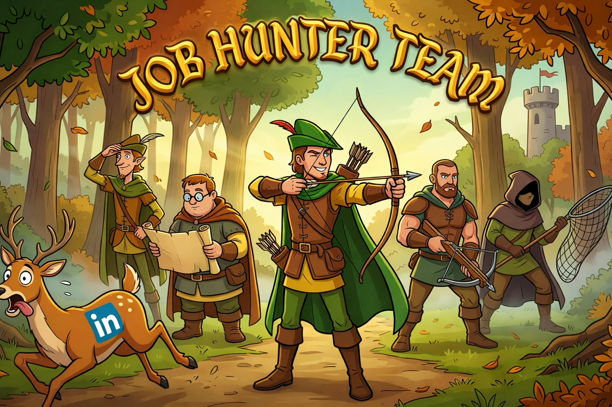
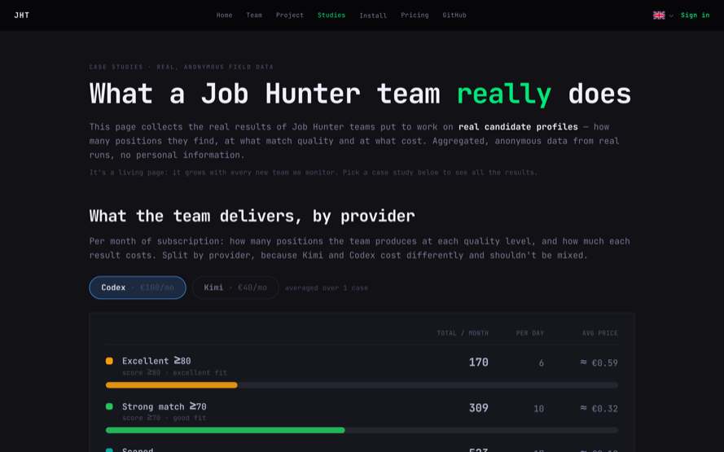
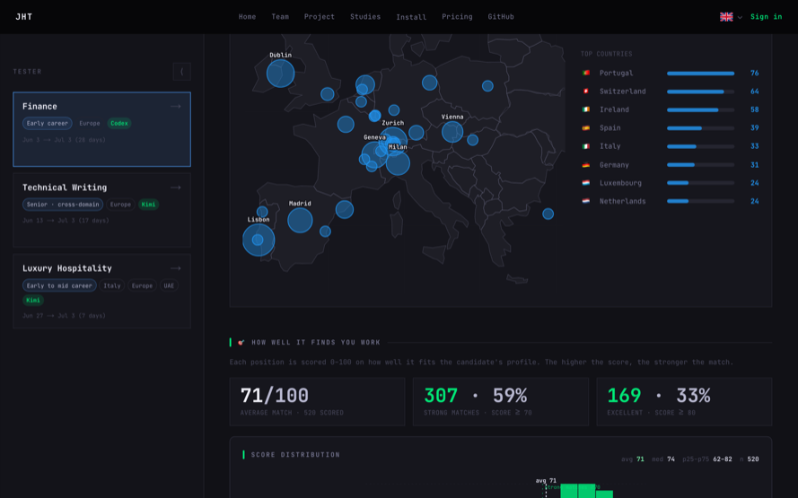
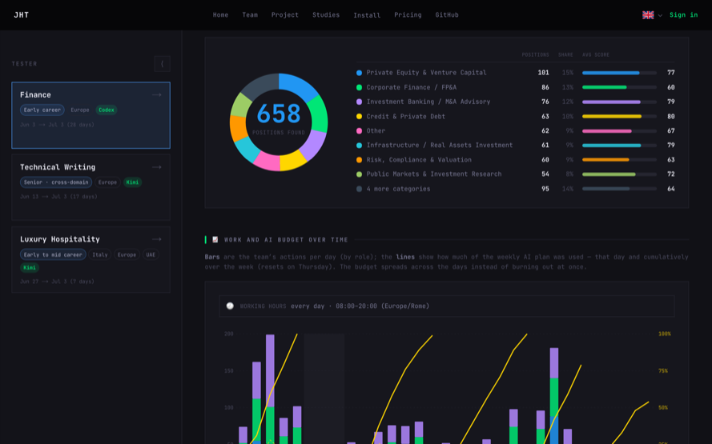

<p align="center">
  
</p>

<h1 align="center">Job Hunter Team</h1>

<p align="center">
  <strong>Your AI agent team that hunts jobs for you.</strong><br/>
  From position discovery to tailored CVs and cover letters.
</p>

<p align="center">
  <a href="https://github.com/leopu00/job-hunter-team/actions/workflows/ci.yml"></a>
  <a href="https://github.com/leopu00/job-hunter-team/actions/workflows/test.yml"></a>
  <a href="LICENSE"></a>
  <a href="https://github.com/leopu00/job-hunter-team/stargazers"></a>
  <a href="https://github.com/leopu00/job-hunter-team/commits/master"></a>
</p>

<p align="center">
  <a href="#demo">Demo</a> ·
  <a href="#the-team">The Team</a> ·
  <a href="#install">Install</a> ·
  <a href="docs/about/STORY.md">Story</a> ·
  <a href="docs/about/RESULTS.md">Results</a> ·
  <a href="docs/guides/QUICKSTART.md">Quickstart</a> ·
  <a href="docs/about/ROADMAP.md">Roadmap</a> ·
  <a href="https://jobhunterteam.ai">Website</a>
</p>

---

Job hunting is a second job on top of your job: scanning boards daily, qualifying listings, tailoring every application. JHT hands that grind to a team of AI agents running around the clock — Scout finds positions, Analyst verifies them, Scorer ranks them against your profile, Writer prepares tailored documents, Critic blind-reviews everything — orchestrated by a **Captain**. You only review applications that clear the quality bar.

Everything runs **locally in a container** — your machine or your VPS, your profile, your data, your provider account. JHT itself is **free (MIT)**; it runs on a **dedicated LLM subscription (~€40–200/mo)** — breakdown in [Install](#install). A local model can currently shadow or replace the Scorer only; running the whole team without a supported provider is not available.

I built JHT for my own job hunt — ~200 offers analyzed, ~20 tailored applications, **5 interview invites in a few weeks** ([story](docs/about/STORY.md)). Then I rebuilt it as open source. On the public stack, a Codex team ran **one month unattended**: 658 positions found, 520 scored, 307 strong matches, weekly budget self-managed at 99–100% ([results](docs/about/RESULTS.md)).

## Demo

Live dashboards with real, anonymized field data: [jobhunterteam.ai/case-studies](https://jobhunterteam.ai/case-studies).

<p align="center">
  <a href="https://jobhunterteam.ai/case-studies"></a>
</p>

<p align="center">
  <a href="https://jobhunterteam.ai/case-studies/beta-2"></a>
</p>

<p align="center">
  <a href="https://jobhunterteam.ai/case-studies/beta-2"></a>
</p>

> Numbers are self-reported snapshots of the team's event log, committed in [`web/data/case-studies/`](web/data/case-studies/). Methodology: [`docs/about/RESULTS.md`](docs/about/RESULTS.md).

## The Team

**Always-on core** — 👨‍✈️ **Captain** (orchestration & anti-collision) · 💂 **Sentinel** (event-driven budget watchdog) · 👩‍💼 **Assistant** (platform copilot) · 🧙‍♂️ **Mentor** (career coach)

**Worker pool, scaled 1..N by the Captain** — 🕵️ **Scout** (finds positions) · 👨‍🔬 **Analyst** (verifies them) · 👨‍💻 **Scorer** (0–100 against your profile) · 👨‍🏫 **Writer** (CVs & cover letters) · 👨‍⚖️ **Critic** (3 blind review rounds)

**Daily one-shots** — 🩺 **Dottore** (agent health) · 👷‍♂️ **Mantenitore** (infra health) · plus 📡 **Bridge**, the usage clock (a process, not an agent)

**Why a team instead of one clever prompt?** Each role keeps its own small context (a model that just read 50 job ads reasons measurably worse about CV tone); blind review only works if the Critic genuinely hasn't seen the Writer's reasoning; and the Captain can throttle or scale each role independently to keep 24/7 operation inside a fixed subscription budget.

```
                                       👤 User
                       ┌─────────────────┼─────────────────┐
                       ▼                 ▼                 ▼
               🧙‍♂️ Mentor       👩‍💼 Assistant      👨‍✈️ Captain ◀··intervene·· 💂 Sentinel ◀──notify── 📡 Bridge
                                                           │
                                                           ▼
                                  🕵️ Scout → 👨‍🔬 Analyst → 👨‍💻 Scorer → 👨‍🏫 Writer → 📤✅ Ready to submit
                                                                          ⇅
                                                                     👨‍⚖️ Critic (3 blind rounds)
```

Each agent is an autonomous AI session on one of the supported CLIs (Claude Code, Codex, Kimi); a shared SQLite database keeps state in sync. Monitoring details: [`docs/about/MONITORING.md`](docs/about/MONITORING.md).

## Install

Choose the **native office** for the guided visual experience, or the **CLI**
for automation and remote administration. Both control the same containerized
team.

**Before you install:**

- Windows x64, Linux x64, or macOS (Intel: 11+; Apple silicon: 13+);
- a supported subscription dedicated to JHT (the provider login happens in
  your browser; JHT does not ask for an API key);
- a Docker-compatible runtime for the team. The office can guide the install;
  on Windows, Docker Desktop must complete its own consent and first-run flow;
- about 8 GB of RAM available before starting a local team for comfortable
  use. This is a measured recommendation, not a universal minimum.

Not sure where the container should live? Compare a
[local PC, dedicated Linux PC on the LAN and VPS](docs/guides/CHOOSE-WHERE-TO-RUN.md)
before installing.

**What it costs** — the team burns ~400M tokens/month, so it needs a flat-rate subscription **dedicated to the team** (a shared account hits rate limits): the same usage on pay-per-use APIs would be $1,000–2,500/mo. Reasoning: [ADR-0004](docs/adr/0004-subscription-only-no-api-keys.md) · details: [`docs/about/PROVIDERS.md`](docs/about/PROVIDERS.md).

| Provider | Plan | Cost/mo | Status |
|---|---|---|---|
| **Claude** | Max x20 | ~€200 | Production-ready, best precision |
| **Codex** | Plus / Pro | ~€100 | Proven — 1-month autonomous run |
| **Kimi** | Pro | ~€40 | Beta — in observation |

**Native office (recommended):** download the current build from
[GitHub Releases](https://github.com/leopu00/job-hunter-team/releases/latest).
The release contains `job-hunter-team-windows-x64-setup.exe` for Windows
(with `job-hunter-team-windows-x64-portable.exe` as the no-install
alternative), `job-hunter-team.zip` for macOS, and
`job-hunter-team-linux-x64.tar.gz` for Linux. The macOS build is signed and
notarized; Windows and Linux builds are currently unsigned. Open the office and
select **Activate team**: the checklist requires all four gates — team runtime,
provider login with a plan selected, candidate profile and working hours —
before it starts the agents.

**CLI:** inspect first, then run (macOS / Linux / WSL2). The installer is
[versioned in this repo](scripts/install.sh) and previews every action:

```bash
curl -fsSL https://jobhunterteam.ai/install.sh -o install.sh
less install.sh              # read what it does
bash install.sh --dry-run    # preview every action — no changes to your system
bash install.sh
```

Or the one-liner, if you've read it and trust it: `curl -fsSL https://jobhunterteam.ai/install.sh | bash`

The installer downloads the Compose file, the `jht` host wrapper and its host
preflight helper. It also creates `~/.jht/host.env` and may add the wrapper
directory to your shell `PATH`. The agents themselves run in an isolated
container; only `~/.jht` and `~/Documents/Job Hunter Team` are mounted.

Full walkthrough, expert mode and contributor setup: [`docs/guides/QUICKSTART.md`](docs/guides/QUICKSTART.md).

## Interfaces

**Native desktop app** (supported Godot office in [`game/`](game/); migration
started in [`desktop/`](desktop/) with
[Tauri 2 + React](docs/adr/0011-tauri-desktop-shell.md)) · **CLI** (`jht team
start` — [reference](docs/guides/CLI-REFERENCE.md)) · **Cloud dashboard**
(Next.js) · **Telegram**

## AI agents can drive JHT

The `jht` CLI is designed to be driven by AI assistants, not just humans. Already use **Claude Code**, **🦞 OpenClaw**, **Codex** or **Cursor**? Tell it *"Set up JHT and start the team for me"* — it figures out the rest. Guide: [`docs/guides/AI-AGENT-INTEGRATION.md`](docs/guides/AI-AGENT-INTEGRATION.md).

## Stack & status

**Stack** — current desktop: Godot 4.7; target desktop: Tauri 2/Rust shell +
React, with Godot retained as an optional office · Node.js/TypeScript + Python
(the API-worker direction is Node/TypeScript; the shipped team is still
Python/tmux during migration) · Next.js 16 + Supabase (cloud dashboard) · Docker
· SQLite · GitHub Actions + Vercel.

**Status** — team, CLI, web dashboard and native Godot application are tested
across all three providers; onboarding, operations and settings currently live
in the office. The staged desktop migration is documented in
[`2026-08-24-desktop-tauri-migration.md`](docs/internal/roadmap/2026-08-24-desktop-tauri-migration.md).
Its first path is intentionally narrow: the user's own PC, Podman containers
and Node.js headless agents using the user's own OpenAI API key. The complete
future setup matrix is documented in
[`2026-08-24-desktop-setup-modes.md`](docs/internal/architecture/2026-08-24-desktop-setup-modes.md).
Full picture: [`docs/about/ROADMAP.md`](docs/about/ROADMAP.md).

Monorepo: [`desktop/`](desktop/) · [`game/`](game/) · [`cli/`](cli/) · [`web/`](web/) · [`shared/`](shared/) · [`agents/`](agents/) · [`api-worker/`](api-worker/) *(headless API agents)* · [`scripts/`](scripts/) · [`e2e/`](e2e/) · [`supabase/`](supabase/) · [`docs/`](docs/) — index in [`docs/README.md`](docs/README.md).

## Contributing

Bug reports and pull requests are welcome; the workflow is in
[`CONTRIBUTING.md`](.github/CONTRIBUTING.md). For security issues, follow
[`SECURITY.md`](SECURITY.md) and do not open a public issue.

## License

MIT — see [LICENSE](LICENSE).
