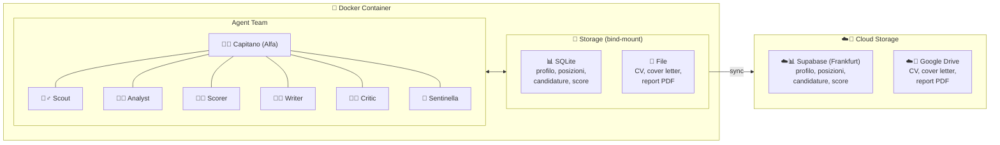

# Infrastruttura Job Hunter Team — Test Mermaid

```mermaid
graph LR
    subgraph Docker["🐳 Docker Container"]
        direction TB
        subgraph Team["Agent Team"]
            direction TB
            Capitano["👨‍✈️ Capitano (Alfa)"]
            Scout["🕵️‍♂️ Scout"]
            Analyst["👨‍🔬 Analyst"]
            Scorer["👨‍💻 Scorer"]
            Writer["👨‍🏫 Writer"]
            Critic["👨‍⚖️ Critic"]
            Sentinella["💂 Sentinella"]
            Capitano --- Scout
            Capitano --- Analyst
            Capitano --- Scorer
            Capitano --- Writer
            Capitano --- Critic
            Capitano --- Sentinella
        end
        subgraph Storage["💾 Storage (bind-mount)"]
            direction TB
            SQLite["📊 SQLite
            profilo, posizioni,
            candidature, score"]
            File["📁 File
            CV, cover letter,
            report PDF"]
        end
        Team <--> Storage
    end

    subgraph Cloud["☁️💾 Cloud Storage"]
        direction TB
        Supabase["☁️📊 Supabase (Frankfurt)
        profilo, posizioni,
        candidature, score"]
        GDrive["☁️📁 Google Drive
        CV, cover letter,
        report PDF"]
    end

    Storage -- sync --> Cloud
```
