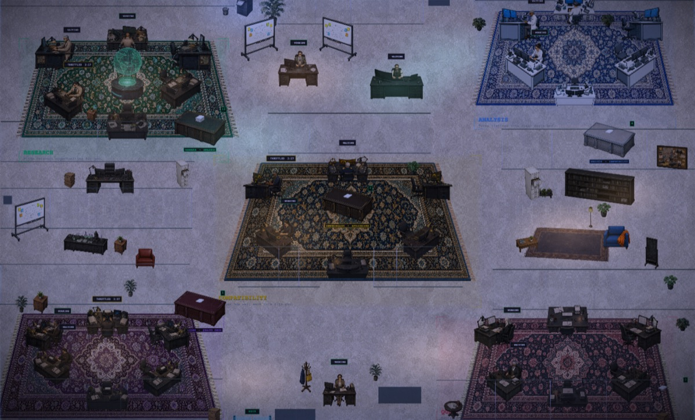
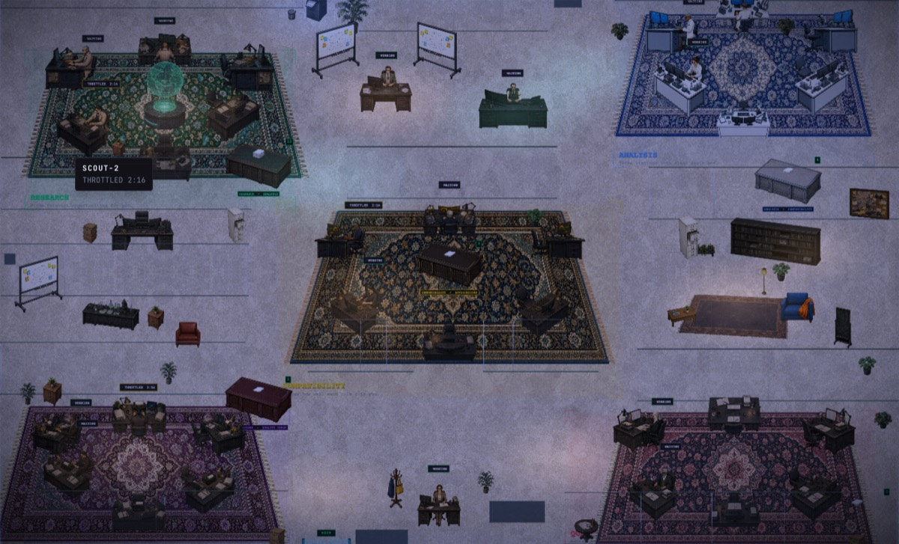
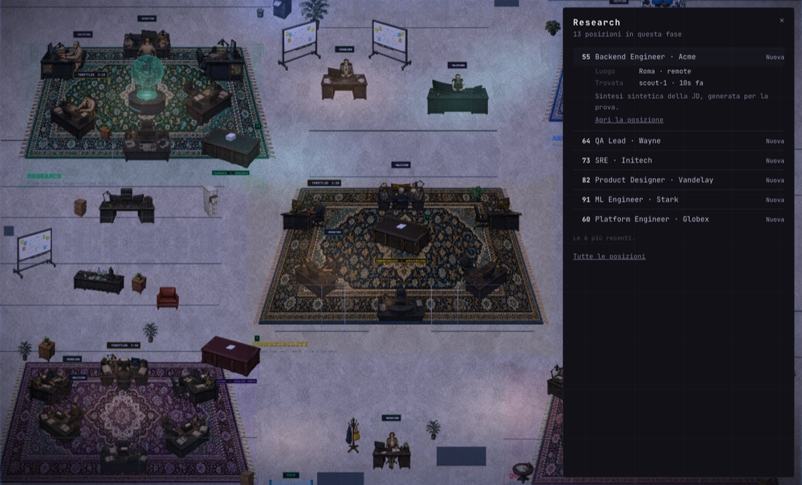
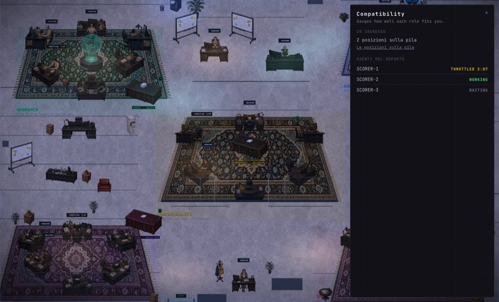
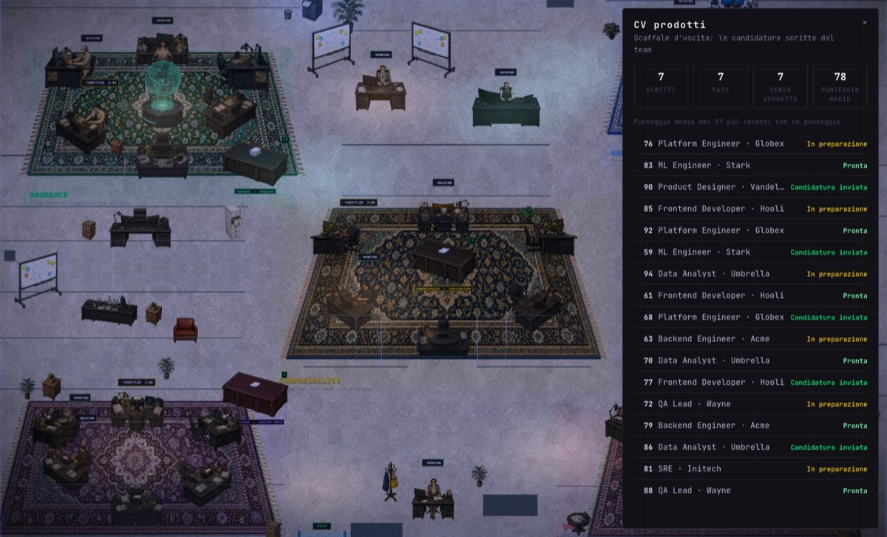

# 🖥️ Desktop app — user guide

The desktop app is the **control panel** of your Job Hunter Team: the same
pages as the website, plus pages of its own, and the **office**, where you
watch the team at work. It reads the cloud with **your own session** (you see
only your rows; no privileged key ships in the app).

- 🔑 [Signing in](#-signing-in)
- 🧭 [The navbar](#-the-navbar)
- 📄 [The pages](#-the-pages)
- 🏢 [The office](#-the-office)
- ⌨️ [Moving around the office](#️-moving-around-the-office)
- 🚫 [What the desktop cannot do, and why](#-what-the-desktop-cannot-do-and-why)

> The screenshots in this guide are taken on **test data**: made-up positions,
> companies and agents, not anyone's account.

---

## 🔑 Signing in

1. Open the app and click **Accedi con Google**.
2. Google does not allow sign-in inside an embedded window, so the sign-in page
   opens in your **system browser**. The app lists the browsers it finds; the
   last one you picked is remembered.
3. After you confirm, the browser hands the session back to the app and the
   app opens the dashboard.

The session is stored encrypted on this computer, with its key in the
operating system's keychain. **ESCI** signs out this app only: the website and
your other devices stay signed in.

## 🧭 The navbar

| Item | What it does |
| --- | --- |
| **Dashboard · Map · Posizioni · Swipe · Team · Messaggi · Profilo** | The website's pages, run inside the app with your session. |
| **Agenti · Budget · Ufficio** | The desktop's own pages (no website counterpart). |
| **AGGIORNA** | Reads the current page's data again, now (in the office, as soon as a minute has passed since its last read). |
| **TEAM LOCALE** | The setup of a team on this computer (container engine, provider key, a first test run). |
| **ESCI** | Signs this app out. |

## 📄 The pages

| Page | What you find there |
| --- | --- |
| **Dashboard** | The overview: how many positions there are, excluded and active, the latest scored ones, the applications over time, and the charts by type, country, city, score and salary. |
| **Map** | Where the positions are, on a map. |
| **Posizioni** | Every position, with filters, search, sorting and columns. A row opens the position's page. |
| **Position page** | One position in full: the job description, the scores, the CV and cover letter status, notes, and the requests you can make to the team (write the CV, re-check, a new score, mark it applied, record an outcome). |
| **Swipe** | Positions one at a time, to keep or to exclude quickly. |
| **Team** | The team's pages: its log, and one page per role (Scout, Analyst, Scorer, Writer, Critic). |
| **Messaggi** | The chat with the team's agents. |
| **Profilo** | Your candidate profile as the team reads it, and its export. |
| **Agenti** | The agents one by one: on the left the list, on the right the chosen agent. For the agents you talk to, the conversation; for the others, their latest moves. |
| **Budget** | What the team on **this computer** spent: its runs, the spend against each run's cap, per role and per agent. Below, the tmux team's usage window from the cloud (5 hours, week, reset, projection). |
| **Ufficio** | The office: see below. |

## 🏢 The office

The office is the team drawn as a place: each department at its desks, the
papers moving from one department to the next, and each agent at work. It
shows **what the cloud knows**, and never makes anything up: an agent with no
data is not drawn, a status the team did not publish is not shown.

### Who is in the office

- Every agent that moved a position in the **last 24 hours**.
- The **Captain**, the **Sentinel**, the **Assistant** and the **Mentor** at
  their own seats, while the team is running.
- If the team is off, the office says so: the Captain, the Sentinel, the
  Assistant and the Mentor are not there, and the agents that moved a position
  in the last 24 hours stay, with no status tags.

Agents come in through the **door** and leave through it. When an agent moves
a position, it walks the trip: it takes a sheet from the previous
department's pile, works on it at its desk, and puts it on its own pile, whose
number changes when the sheet arrives. Only real moves are walked: when you
open the office, the moves already made are the past, and nobody walks them.

### The office keeps itself up to date

You do not need to reload it. The office listens to the cloud: when the team
moves a position, the trip starts at once, and when anything else changes
(a position, the team's state) the office reads the cloud again. It reads at
most **once a minute**, however many changes arrive; if the connection to the
cloud drops, it reads once a minute on its own until it comes back.

### The departments

| Name on the floor | Who works there | Their pile holds |
| --- | --- | --- |
| **Research** | Scouts | New positions, waiting for the analysts |
| **Analysis** | Analysts | Analysed positions, waiting for a score |
| **Compatibility** | Scorers | Scored positions you have not asked to write for |
| **Applications** | Writers | Applications being written, and ready ones without the critic's PASS |
| **Quality check** | Critics | Applications with the critic's PASS |

### The objects

| Object | What it means | Click |
| --- | --- | --- |
| **Paper piles** on the handoff tables | The positions waiting in that phase; the number is the count. | The positions of that phase, with the details of each. |
| **A department's zone**, its whiteboard | The department. | What it does, how many positions are waiting for it, its agents and their status. For Research, the positions found day by day over the last week. |
| **Output shelf** and **printer** | The CVs the team produced. | The CVs written, how many passed the critic, how many are waiting for a verdict, and the latest with the critic's notes. |
| **Corkboard** | The positions ready, sent and answered. | Those positions, counted and listed. |
| **Hologram** (the globe) | Where the positions are. | The most frequent places, and a link to the Map. |
| **The tag over an agent** | What the agent is doing now: **WORKING**, **WAITING**, **PAUSED**, **THROTTLED** (with the pause's countdown when it is known). | — |
| **An agent** | One member of the team. | Its status, the positions in its hands, its latest moves, and a link to its page. |

The tags appear only when the team publishes its agents' status; a status
older than two minutes is not shown. The lights follow the time of day on your
computer.

### Clicking and hovering

- **Hover** anything that can be opened: a small tag tells what it is and the
  essentials (for an agent: its status and its last move).
- **Click** opens a panel **inside the office**, on the right: the office stays
  in sight. The links in the panel (the agent's page, a position, the Map) are
  the only thing that takes you to another page.
- A click on an empty spot, **Esc**, or **✕** closes the panel.

| A pile: that phase's positions, one opened in place | A department: what it does, its inbox, its agents | The CV shelf: the CVs written and their critique |
| --- | --- | --- |
|  |  |  |

## ⌨️ Moving around the office

| With | Does |
| --- | --- |
| Drag with the mouse, two-finger scroll on a trackpad | Moves the view. |
| Mouse wheel, trackpad pinch, **+** / **−** | Zooms. |
| **W A S D** or the arrows | Move the view. |
| Double click, **0** or **Home** | Back to the first view. |
| **Tab** / **Shift+Tab** | Goes from agent to agent and object to object; a ring shows which, with its tag beside it. |
| **Enter** or **Space** | Opens the panel of what has the ring. |
| **Esc** | Closes the panel; the ring goes back where it was. |

At its widest the view always fills the window: what is past the edge is
reached by moving.

**Screen readers** read each agent and object with the same words as its tag.
If your system asks for **reduced motion**, the office keeps still: no film
grain, no pulsing light, the hologram and the printer hold, and the trips are
not walked: when the team moves a position, the piles' numbers change at
once. Agents still come in and leave through the door, because who is in the
office is the team's data.

## 🚫 What the desktop cannot do, and why

The app works with your own session only. Whatever needs a privilege that only
the server has, or data that never leaves the machine where the team runs, is
not in the app.

| What | Why |
| --- | --- |
| **Download the CV or cover letter PDF** from a position | The download link is signed with a server privilege that does not ship in the app. The button shows its error state. |
| **Open encrypted contact details** in the profile | They are decrypted with a key that lives only on the server. The app says they are encrypted. |
| **Edit the profile through the Assistant** | That goes through a chat with the team's Assistant on the team's machine; the app does not talk to it yet. |
| **See what an agent is doing inside its terminal**, its CPU, memory and tokens | That stays on the machine where the team runs; the cloud does not have it. |
| **See what a server team spent in dollars** in Budget | Budget shows the runs and spend of the team on this computer. A tmux team, on this computer or a server, shows its usage window from the cloud (5 hours, week, reset, projection), not dollars: it runs on a subscription. |
| **Change anything from the office** | The office is for looking and understanding. Every action stays where the app already offers it (for example the requests on a position's page). |
