# Infrastructure — Job Hunter Team

> 📐 **High-level deployment diagram.** It shows the unit of deployment (the container), the deployment locations (local / dedicated / self-hosted VPS), and the optional sync to managed storage. Not every agent is drawn individually — the full team composition is documented in the [README](../../README.md) and in `agents/`.
>
> Source: [`infra.d2`](../assets/infra.d2).

## At a glance

### 🐳 Docker container — the unit of deployment

Everything operational runs inside a single container: the agent team and local storage (SQLite for structured data, files for CVs and output). Same image, same behavior, whether it runs on a personal PC, a dedicated home computer, or a self-hosted VPS.

### 🔀 Where the team runs — three modes, one location at a time

The user picks **one** location. The choice is **exclusive**: only one container is active at a time — two teams running in parallel (e.g. one local, one self-hosted on a VPS) would fight over the same state and corrupt each other.

The same Docker image runs in all three modes — only the host machine changes:

1. **🖥️ Local PC** — on the user's everyday machine. Available today. *Not recommended for daily-use machines* (8 agents in parallel = high resource usage + the PC must stay on). Acceptable for very powerful desktops or for night-only runs.
2. **🏠 Dedicated computer** — a second PC at home (old laptop, mini-PC, spare desktop), plugged in and left on for weeks/months. Same setup as Local, just different hardware. Planned UX in PHASE 2 (LAN discovery + SSH-based setup).
3. **☁️ Self-hosted VPS** ⭐ **target setup** — a small server rented from a cloud provider (Hetzner ~€4.5/mo, AWS, GCP). Cheaper than buying a dedicated PC and rented only during the active job-hunt months. The team runs in the user's own VPS — there is no managed JHT service. Planned UX in PHASE 3 (one-click provisioning).

The dashboard is served by the container itself:
- Local / Dedicated → `localhost:3000`
- Self-hosted VPS → published on the VPS's public IP (or behind a tunnel, see [`JHT-CLOUD-06`](../BACKLOG.md))

### ☁️ Optional managed storage (read-only mirror)

Two managed services can hold a **read-only mirror** of the operational state:

- **Supabase** — PostgreSQL for structured metadata (positions, scores, applications) + auth
- **Google Drive** — user files (CVs, cover letters, generated PDFs)

This is **opt-in for Local PC**, **mandatory for VPS** (the VPS uses cloud storage as the only way to recover state if it dies). When enabled, the local container periodically pushes a snapshot of operational state to Supabase + Drive so the user can:
- Browse positions/applications from another device (phone, work laptop)
- Have a backup against local data loss
- Visit `jobhunterteam.ai` and see their own results in the web dashboard
- Migrate to a new machine without losing data (see "Bootstrap" below)

> 📡 **No LLM calls happen on the managed storage side.** The agents always run inside the local container. Supabase and Drive are storage only.

> 🔄 **Bootstrap automatico (decisione 2026-05-13)**: il sync è **push-only** local → cloud. Quando l'utente fa login con lo stesso account su un **container nuovo/vuoto** (es. nuova VPS appena installata, o nuovo PC dopo perdita del vecchio), l'app rileva che il DB locale è vuoto e fa un **pull automatico** dal cloud — DB locale allineato, da lì in poi push normale. Niente comandi manuali, niente backup/restore Docker volume.
>
> **Cosa si sincronizza**: posizioni + metadati (`jobs.db`), profilo utente (`candidate_profile.yml`), tema/settings dashboard. Memoria agenti runtime (tmux, skill state) e CV binari → restano locali. Vedi `project_cloud_sync_direction` per la spec.

### 👤 Clients — how the user talks to the team

Three channels today, each with a different audience:

- **🌐 Browser** (web dashboard — `localhost:3000` for Local/Dedicated, public URL for self-hosted VPS) — the user can address **any agent** individually. Talking to the Captain is the recommended default (it coordinates the pipeline), but the user can reach any team member directly.
- **💬 Telegram** — **3-bot bidirectional bridge** (decisione 2026-05-13 rev2): Assistente (orchestrator user-facing), Capitano (status + decisioni operative), Mentor (career coach always-on). Tutti e tre obbligatori nell'onboarding wizard, routing per ruolo via `tg-bridge` + skill `jht-telegram-send` distribuita. Roadmap futura ([`docs/about/ROADMAP.md`](../about/ROADMAP.md)): per-agent 1:1 chat (Scout/Critic/Writer/Scorer/Sentinel) + "team forum" channel.
- **⌨️ CLI + tmux** *(technical users)* — `jht team attach <agent>` to drop directly into the agent's tmux session and watch it work live (raw model output, tool calls, decisions). Useful for debugging, for understanding what the agents are actually doing, and for power users who prefer the terminal.

In addition, the `jht ...` CLI is intentionally driveable by other AI agents — see [`docs/AI-AGENT-INTEGRATION.md`](../guides/AI-AGENT-INTEGRATION.md). Your Claude Code / 🦞 OpenClaw / Codex / Cursor can configure and start JHT for you autonomously.

## Related

- 🎯 [`docs/VISION.md`](../about/VISION.md) — design philosophy, why local-first, why no SaaS
- 💳 [`docs/PROVIDERS.md`](../about/PROVIDERS.md) — supported subscriptions matrix
- 📊 [`docs/MONITORING.md`](../about/MONITORING.md) — Bridge/Sentinel monitoring stack (architecture + test data)
- 🔒 [`docs/MAINTAINERS.md`](MAINTAINERS.md) — internal operations reference
- 🗺️ [`docs/ROADMAP.md`](../about/ROADMAP.md) — what's coming next
