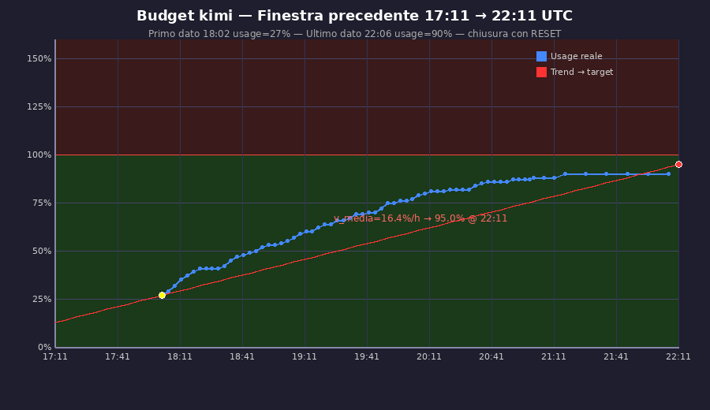
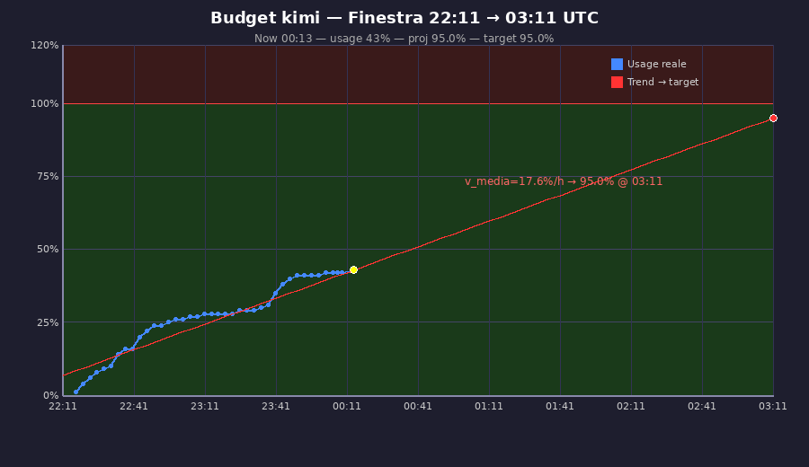

# 2026-05-17 — Budget windows Kimi: 2 finestre consecutive, entrambe in target

Sessione operativa: il team Job Hunter Team ha lavorato per **2 finestre Kimi
consecutive** (5 h ciascuna, reset 22:11 e 03:11 UTC) generando 5+ CV
personalizzati. Il Capitano ha prodotto **4 grafici matplotlib** di
self-monitoring del budget, allegati qui.

## TL;DR

Entrambe le finestre chiuse dentro la **G-spot 90-95 %** (target storico
del rate-budget Kimi, vedi
[`2026-05-01-bridge-and-token-monitoring.md`](../../internal/2026-05-01-bridge-and-token-monitoring.md)):

| Finestra | Apertura | Chiusura/proj | Target | Verdict |
|---|---|---|---|---|
| 17:11 → 22:11 | 27 % @ 18:02 | **90 %** chiusa con RESET | 95 % | ✅ ottimo |
| 22:11 → 03:11 | 0 % @ 22:11 | **95.0 %** proj @ 03:11 | 95 % | ✅ perfetto |

Il freeze Sentinella delle 22:45 (proj momentaneamente a 207 %) ha causato
30-60 min di rallentamento, ma il team ha recuperato — proiezione finale
allineata col target.

## I 4 grafici

### `budget_chart_prev.png` — Finestra **17:11 → 22:11** (retrospettiva)



- Linea **blu** = usage reale campionato dal `sentinel-bridge.py`
- Linea **rossa** = trend retta verso target 95 % @ reset
- Punto **giallo** = primo dato (27 % @ 18:02)
- Punto **rosso** = chiusura con RESET (90 % @ 22:11)
- Annotation: `v_media = 16.4 %/h → 95.0 % @ 22:11`

Salita lineare quasi perfetta, chiusura al 90 % = -5 punti dal target ma
ancora dentro G-spot. **Esempio canonico di finestra ben gestita**.

### `budget_chart.png` — Finestra **22:11 → 03:11** (corrente, snapshot 00:13)



- Subtitle: `Now 00:13 — usage 43 % — proj 95.0 % — target 95.0 %`
- Al punto **giallo** (00:13) la linea blu reale e la linea rossa trend
  retta sono **sovrapposte**: il ritmo attuale punta esattamente al target
- Annotation: `v_media = 17.6 %/h → 95.0 % @ 03:11`
- Background a zone (sfondo verde 0-95 %, sfondo rosso sopra 95 %) come
  feedback visivo della G-spot

Storia della finestra:
- 22:11 start (usage 0 %)
- 22:45 picco proj 207 % → Sentinella `[EMERGENZA]` freeze totale
- 23:00 trend `SCENDE_OK`, proj 175 %
- 23:30 proj 115 %
- 23:45 ripresa controllata su pressione utente (vedi
  [bug #3 Capitano gerarchia](../../internal/2026-05-17-team-strategy-bugs.md))
- 00:13 ritmo normalizzato, proj 95 % esatto

### `usage_chart.png` e `usage_chart_v2.png` — iterazioni intermedie

I 2 abbozzi del Capitano (23:29 e 00:11) prima della versione finale. Solo
linea usage senza trend retta: utili per vedere come l'agente itera sul
visual feedback dell'utente fino al risultato richiesto.

## Come sono stati generati

Il Capitano ha usato **matplotlib** via `Shell(python3 ...)` senza skill
formali — solo ragionamento. Pattern emergente:

```python
# pseudo, ricostruito dal codice generato runtime
import matplotlib.pyplot as plt
import json
# legge /jht_home/logs/sentinel-data.jsonl
entries = [json.loads(l) for l in open("/jht_home/logs/sentinel-data.jsonl")]
# filtra finestra corrente (post ultimo RESET)
# plot blu = usage, rosso = trend retta verso target
plt.savefig("/tmp/budget_chart.png", dpi=120)
```

Poi invio via `jht-telegram-send --from capitano --photo /tmp/budget_chart.png`
(conferma che lo script supporta `sendPhoto` di Bot API, non solo
`sendMessage`).

**Implicazione**: non serve formalizzare una skill `generate-chart` — il
pattern funziona già out-of-the-box per qualsiasi agente che voglia
mandare visualization all'utente. Si potrebbe documentare come reference
per Mentor (digest settimanale visivo) e Scout (report ricerca posizioni).

## Connessione con altri documenti

- [`docs/internal/2026-05-17-team-strategy-bugs.md`](../../internal/2026-05-17-team-strategy-bugs.md)
  — 7 bug strategici emersi nella stessa sessione (Sentinella aggressiva,
  Capitano gerarchia user override, voice/photo Whisper/OCR, ecc.)
- [`docs/internal/2026-05-01-bridge-and-token-monitoring.md`](../../internal/2026-05-01-bridge-and-token-monitoring.md)
  — definizione G-spot 90-95 % e Bridge V6 (versione attuale)
- [`docs/internal/2026-05-03-rate-kimi-weights.md`](../../internal/2026-05-03-rate-kimi-weights.md)
  — pesi rate-budget Kimi K2 (1 % ≈ 30-40 kT input+output)
- `cap-photo-00-08.jpg` e `cap-voice-19-14.ogg` (in
  `docs/internal/conversations/2026-05-17/`, gitignored) — materiale
  privato utente mandato nella stessa sessione: screenshot della dashboard
  `/positions` e nota vocale 2 s mai trascritta (vedi bug #1)
