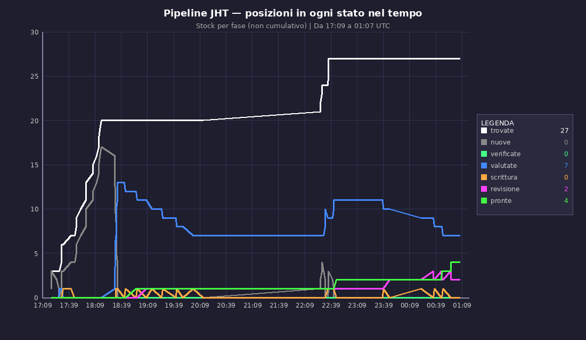
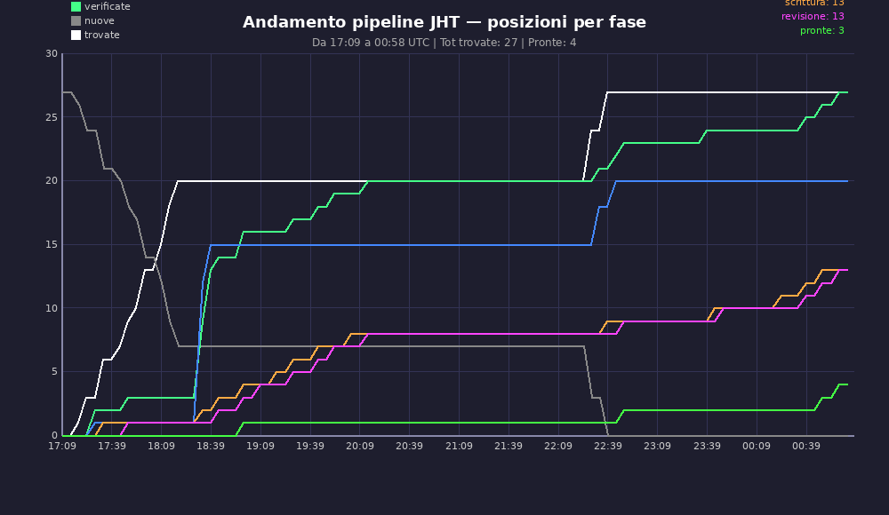
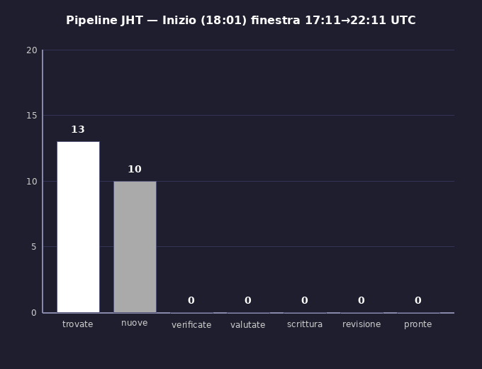
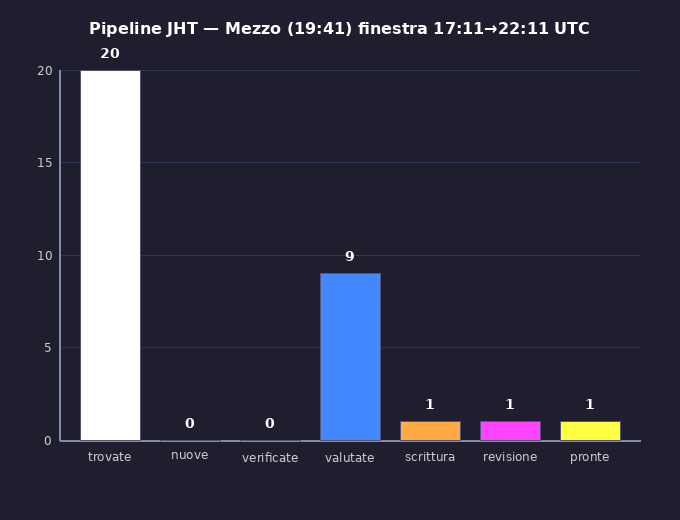
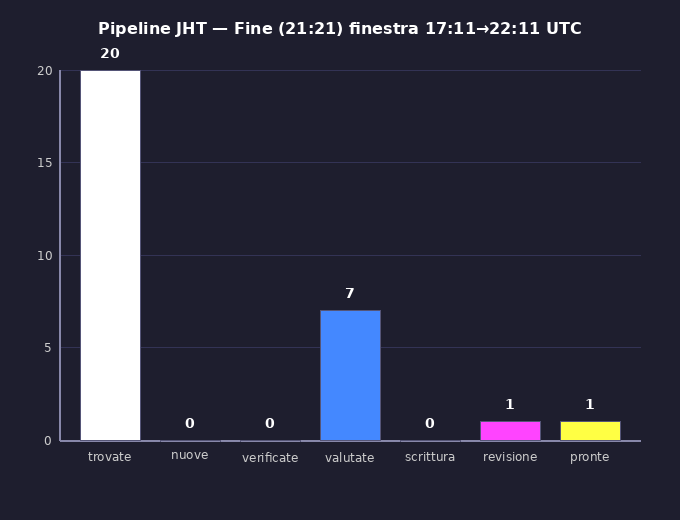
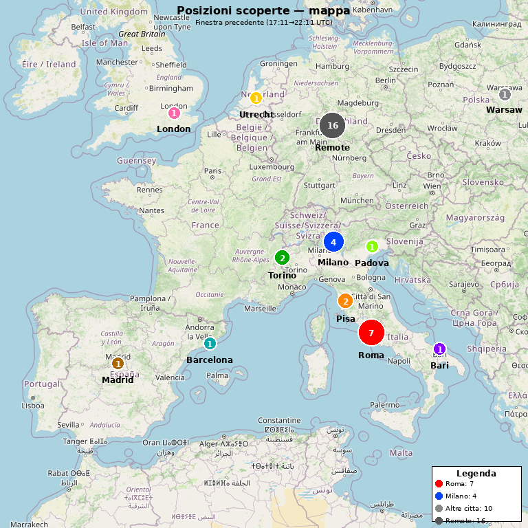
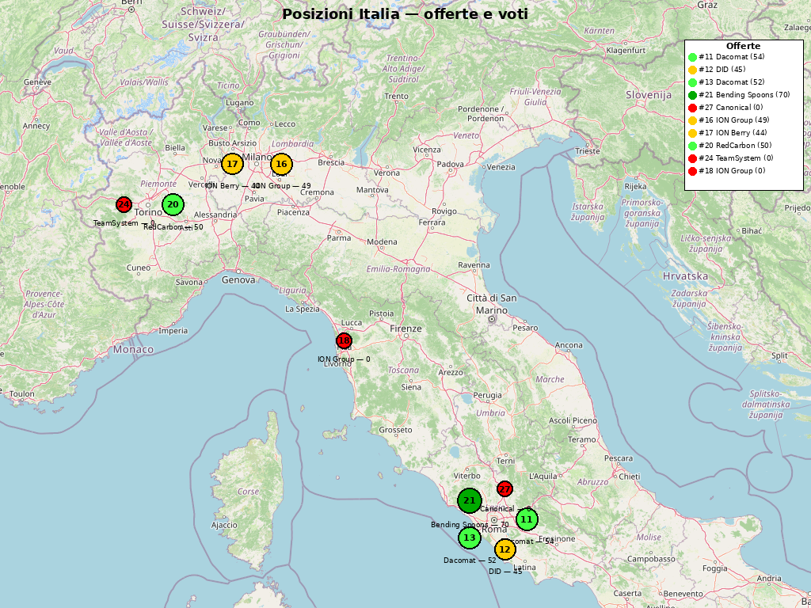

# 2026-05-17 — Pipeline snapshot charts (Capitano on-demand)

Seconda sessione di grafici on-demand del Capitano (post chiusura finestra
Kimi 22:11→03:11 UTC). Tema: **visualizzazione stato pipeline**, non più
budget. L'utente ha iterato 4 volte sullo stesso grafico per arrivare alla
forma giusta — questa cartella documenta sia il risultato finale sia la
prima iterazione sbagliata, perché il pattern di iterazione mostra un bug
architetturale del DB (vedi `2026-05-17-team-strategy-bugs.md` bug #14).

## TL;DR

| File | Cosa è | Verdict |
|---|---|---|
| `pipeline_stock_chart_final.png` | Stock per fase 17:09→01:07 UTC | ✅ buono ma "verificate"=0 sempre |
| `pipeline_chart_iter1_cumulative_bug.png` | Prima iterazione (cumulativo) | ❌ concettualmente sbagliato — kept as reference |
| `candle_window_inizio.png` | Snapshot 18:01 UTC (inizio finestra 17:11→22:11) | ✅ visualmente ok, ma "verificate"=0 |
| `candle_window_mezzo.png` | Snapshot 19:41 UTC (mezzo finestra 17:11→22:11) | ✅ visualmente ok, ma "verificate"=0 |
| `candle_window_fine.png` | Snapshot 21:21 UTC (fine finestra 17:11→22:11) | ✅ visualmente ok, ma "verificate"=0 |
| `host_budget_chart.png` | Budget host-side (Mac dell'utente, non Kimi) | ✅ |
| `positions_map_europe.png` | Mappa Europa con pin posizioni | ✨ |
| `positions_map_italy.png` | Mappa Italia zoom con nomi aziende | ✨ |

## Storia delle richieste utente (verbatim, da `/jht_home/logs/messages.jsonl`)

| Ora UTC | Richiesta | Capitano produce | Esito |
|---|---|---|---|
| 00:56 | *"fammi un grafico temporale su png su andamento pipeline ci devono essere le seguenti linee: trovate - nuove - verificate - valutate - scrittura - revisione - pronte"* | `pipeline_chart.png` (cumulativo) | ❌ grafico cumulativo |
| 01:01 | *"no stai facendo grafico cumulativo - io voglio vedere ad ogni tick quante posizioni ci stavano in quel momento in quello stato"* | `pipeline_stock_chart.png` | ⚠️ stock ok ma senza didascalia |
| 01:04 | *"rigurdati la png che mi hai mandato - non ha didascalia di tutte le linee"* | `pipeline_stock_chart2.png` | ⚠️ con didascalia ma trimmata |
| 01:06 | *"di nuovo mi hai dato png trimmata - prima di darmi risultato sbagliato guarda visivamente sempre quello che produci e correggi finche non è fatto bene il layout"* | `pipeline_stock_chart3.png` ⭐ | ✅ versione finale ⇒ `pipeline_stock_chart_final.png` |
| 01:08 | *"poi fammi anche altri 3 grafici - i grafici si baseranno sui dati di finestra precedente - dividiamo il tempo della sessione in 3 → 3 grafici - inizio - in mezzo e fine. Ogni grafico deve avere candela per ogni stato con il suo numero"* | `pipeline_candle_*.png` (v1) | ❌ "verificate" e "pronte" stesso colore |
| 01:08:50 | *"verificate e pronte hanno stesso colore"* | `pipeline_candle_max_*.png` (v2) | ⚠️ colori ok ma "verificate"=0 in tutti e 3 |
| 01:11 | *"in nessuno dei 3 grafici vedo nuove o verificate - come mai? correggi"* | `pipeline_candle_snap_*.png` (v3) ⭐ | ⚠️ versione finale di layout ma stesso bug "verificate"=0 |
| 01:15 | *"ora non ci sta mai candela verificate - come mai?"* | (msg testuale #31) | 💡 **Capitano scopre la causa**: stato DB transitorio |
| 01:19 | *"ok rifammi grafico usage temporale"* | `budget_chart_late.png` (in `2026-05-17-budget-windows/`) | ✅ proj 92.2% on-target |
| 01:23 | *"fammi png on mappa geografica con pin location delle posizioni trovate"* | `positions_map_europe.png` | ✨ mappa Europa con tile OSM + pin colorati per stato |
| 01:28 | *"fantastico ora fammi solo per italia e metti i nomi"* | `positions_map_italy.png` | ✨ mappa Italia zoom con label aziende |

## Risposta chiave del Capitano (msg #31, 01:15:46 UTC)

> *"Perche nel DB lo stato è transitorio. L'Analista verifica JD e
> azienda, poi lo Scorer immediatamente promuove a scored o excluded. La
> posizione non resta mai in stato 'checked' — passa istantaneamente da
> `new` a `scored/excluded`. Quindi `checked=0` in ogni snapshot. Se vuoi
> posso cambiare la definizione: 'verificate' = tutte le posizioni che
> hanno superato la verifica (scored + writing + ready + excluded)."*

**Conclusione dell'utente**: dovremmo **loggare anche il cambio di stato**.
Vedi bug #14 in [`2026-05-17-team-strategy-bugs.md`](../../internal/2026-05-17-team-strategy-bugs.md).

## I 6 PNG, in dettaglio

### `pipeline_stock_chart_final.png` ⭐ (versione finale stock chart)

- **X**: tempo da 17:09 a 01:09 UTC (~8 h, due finestre Kimi affiancate)
- **Y**: numero di posizioni in quello stato in quel momento
- **7 linee**: trovate (bianco), nuove (grigio), verificate (verde scuro),
  valutate (azzurro), scrittura (arancio), revisione (magenta), pronte (verde)
- **Legenda live**: valori correnti a 01:07 UTC — trovate=27, valutate=7,
  revisione=2, pronte=4, tutte le altre **0**
- **Bug visibile**: la linea "verificate" è **sempre a 0**. Idem "nuove"
  scende a 0 dopo le 18:39 e non sale più. La curva "scrittura" pulsa a
  triangolini (compare/scompare in 1-2 tick) — pattern tipico di stato
  transitorio mai catturato dallo snapshot.

### `pipeline_chart_iter1_cumulative_bug.png` (prima iterazione, sbagliata)

Salvata come reference: il Capitano la prima volta ha interpretato "andamento
pipeline" come **cumulativo** (= "quante posizioni *sono passate* per ogni
stato"). L'utente ha corretto: voleva lo **stock istantaneo** (= "quante
posizioni sono *adesso* in ogni stato"). Differenza importante — l'utente
è dovuto intervenire perché il prompt iniziale era ambiguo.

### `candle_window_inizio.png` (18:01 UTC, inizio finestra Kimi 17:11→22:11)

50 minuti dopo l'apertura finestra: 13 trovate + 10 nuove (in flight),
tutto il resto a 0. Lo Scout sta dominando l'inizio.

### `candle_window_mezzo.png` (19:41 UTC)

2h30 dopo l'apertura: 20 trovate, **9 valutate** in coda, 1 scrittura +
1 revisione + 1 pronta. Pipeline in piena attività. Da notare: **nuove=0
e verificate=0** — non perché siano vuoti, ma perché transitano in < tick.

### `candle_window_fine.png` (21:21 UTC)

50 minuti prima della chiusura finestra: 20 trovate, 7 valutate residue,
1 revisione, 1 pronta. La "scrittura" è scesa a 0 — i Critic loop hanno
finito e tutto è andato in revisione/pronto.

### `host_budget_chart.png` (00:23 UTC, separato)

Grafico inviato dal Capitano alle 00:23 prima della serie pipeline.
Mostra l'usage budget host-side (Mac dell'utente, non Kimi). Diverso
contesto dai grafici pipeline, ma stessa pipeline matplotlib.

### `positions_map_europe.png` ✨ — mappa Europa con pin posizioni

Generata 01:26 UTC su richiesta utente *"fammi png on mappa geografica
con pin location delle posizioni trovate"*. Il Capitano ha:

1. **Scaricato 9 tile OSM** (OpenStreetMap) per coprire Europa Z=5
   (`tile_15-17_10-12.png`).
2. **Mosaico le tile** con PIL/matplotlib per creare un'unica immagine
   base (~752 KB).
3. **Geocodificato** le città delle posizioni nel DB (Milano, Torino,
   Pisa, Roma, Pesaro, Madrid, Barcelona, Utrecht) con lat/lon hardcoded
   o cache locale (l'utente NON ha menzionato chiamate Nominatim — quindi
   probabilmente coordinate hardcoded nel codice generato).
4. **Plot pin colorati** per stato posizione (excluded/scored/ready)
   sopra il tile mosaicato.
5. **Legenda** in alto a destra con icona+stato.

Pattern emergente: il Capitano sa orchestrare **download HTTP + tile
mosaicing + matplotlib overlay** senza skill formali. Esegue tutto in
~3 minuti dalla richiesta.

### `positions_map_italy.png` ✨ — mappa Italia zoom + label aziende

Generata 01:30 UTC su richiesta utente *"fantastico ora fammi solo per
italia e metti i nomi"*. Iterazione:

1. **Bounding box ristretto** all'Italia (12 tile `it_tile_66-69_45-47.png`
   a zoom Z=6, ~360 KB di tile scaricati).
2. **Mosaico Italia** con scala lat/lon ricalcolata per zoom maggiore.
3. **Pin con label aziende** invece di soli colori: vedi "Bending Spoons
   Milano", "ION", "ION Berry", "Gr4vy", "MLabs", ecc.
4. **Legenda dettagliata** in alto a destra con tutte le posizioni
   visibili nella mappa, ordinate per stato/score.

Reazione utente verbatim a positions_map_europe: **"fantastico"** ⭐

Take-away: il Capitano è capace di produrre **visualizzazioni geo
production-grade** out-of-the-box, senza una skill `geo-map` formale.
Bug strategico associato: vedi #16 (auto-generation periodica) per
sfruttare meglio questa capacità.

## Iterazioni intermedie (non versionate)

Le iterazioni intermedie restano su VPS in `/tmp/` per riferimento (e
verranno potate quando il container si riavvia):

- `pipeline_stock_chart.png`, `pipeline_stock_chart2.png` — iter 1 e 2
- `pipeline_candle_inizio/mezzo/fine.png` (v1, colore bug)
- `pipeline_candle_max_inizio/mezzo/fine.png` (v2, fix colore)
- `host_usage_chart.png`, `host_usage_chart_v2.png` — usage senza budget

## Take-away architettuali

1. **Capitano genera matplotlib autonomamente** — confermato pattern già
   visto in `2026-05-17-budget-windows/`. Iterazione visuale con feedback
   utente funziona.

2. **Bug #14 (nuovo)**: stati DB transitori invisibili allo snapshot. Tutte
   le visualizzazioni che mostrano "nuove" o "verificate" daranno sempre 0.
   Fix: event log delle transizioni in `position_state_transitions(position_id,
   from_state, to_state, ts, by_agent)`, poi reconstruct stock con interval
   join. Vedi bug #14 in `docs/internal/2026-05-17-team-strategy-bugs.md`.

3. **Iterazione visuale costosa**: 4 round per layout corretto + 3 round
   per candle colori + 1 round per scoprire il bug strutturale = 8 round
   totali. Conferma valore del task #50 (slash command / inline buttons
   per chart on-demand): fissare i template a monte risparmia ~6-7 round
   di iterazione manuale.

## Connessioni con altri documenti

- [`docs/sessions/2026-05-17-budget-windows/`](../2026-05-17-budget-windows/) —
  prima sessione grafici on-demand (budget windows). Stesso pattern.
- [`docs/internal/2026-05-17-team-strategy-bugs.md`](../../internal/2026-05-17-team-strategy-bugs.md) —
  bug #14 (state transitions log) emerso da questa sessione.
