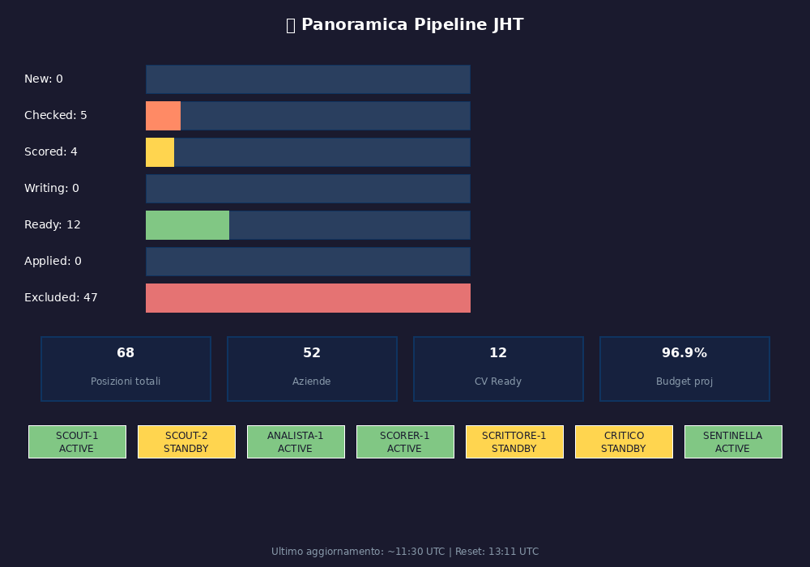
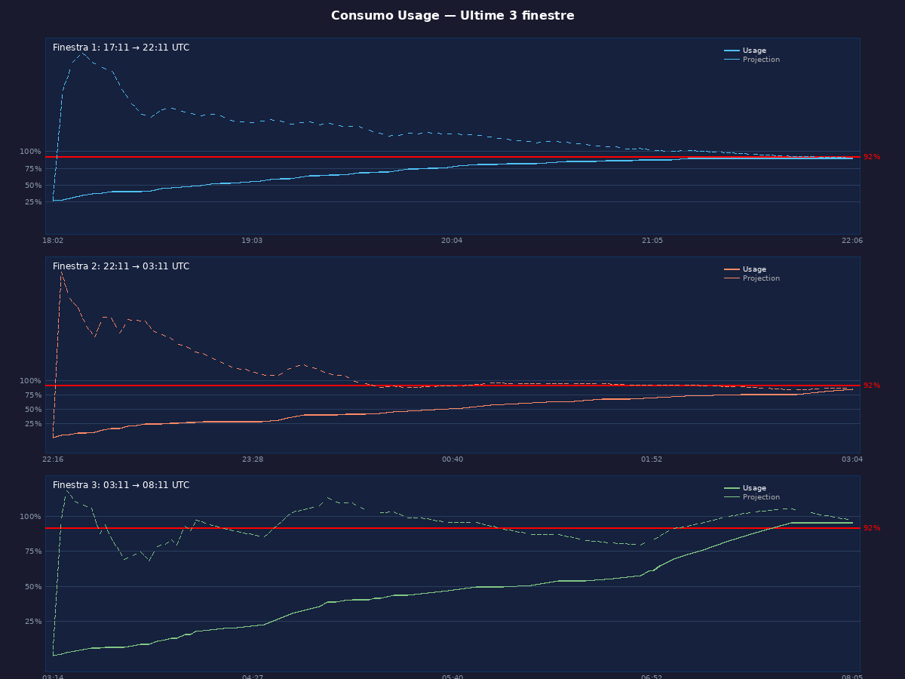
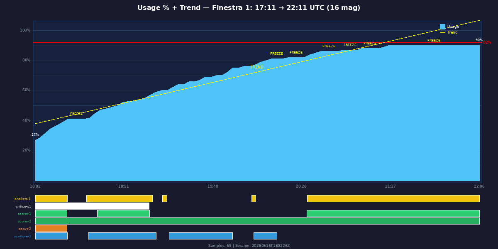
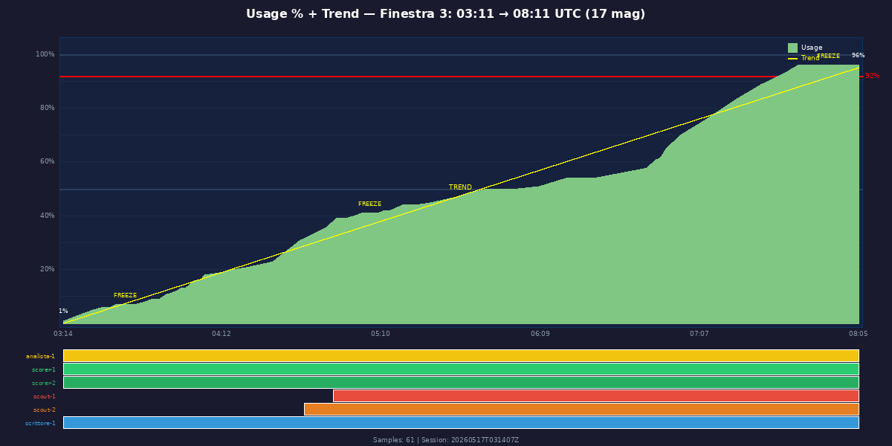
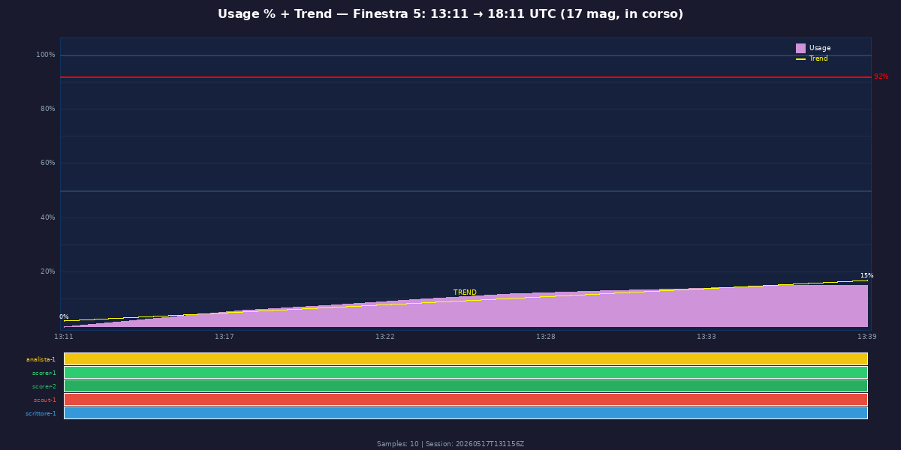
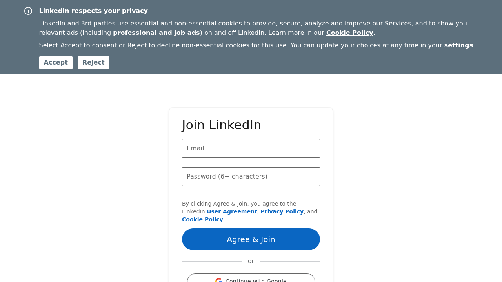

# 2026-05-17 — Team dashboard & 5-window timeline (Capitano on-demand v3)

Terza sessione di grafici on-demand del Capitano (post-reset finestra Kimi
13:11 UTC). Salto qualitativo importante rispetto alle sessioni precedenti:

- **Dashboard panoramica completa** (`pipeline_overview.png`) — primo
  grafico aggregato con bar pipeline + KPI cards + stato agenti
- **Timeline 3 finestre consecutive** (`usage_timeline_3windows.png`) —
  vista d'insieme dell'usage Kimi su ~15 h
- **5 dettaglio per finestra Kimi** (`usage_window_{1..5}_final.png`) —
  ogni finestra con timeline degli agenti attivi sotto il grafico usage
- **3 screenshot LinkedIn** (`scout2_linkedin_*.png`) — Scout-2 esplora
  fonti nuove (LinkedIn) post-RESET, autorizzato dal Capitano alle 13:23

## TL;DR

| File | Cosa è | Reazione utente |
|---|---|---|
| `pipeline_overview.png` | Dashboard JHT con bar fase + KPI + stato agenti | (no feedback) |
| `usage_timeline_3windows.png` | 3 finestre consecutive usage + projection | (no feedback) |
| `usage_window_1_final.png` | Finestra 1 (17:11→22:11 UTC, 16 mag): freeze parziale, 90% close | ✅ "benissimo" |
| `usage_window_2_final.png` | Finestra 2 (22:11→03:11 UTC): 90% close + 4 FREEZE | ✅ |
| `usage_window_3_final.png` | Finestra 3 (03:11→08:11 UTC): 95% close + 2 FREEZE | ✅ |
| `usage_window_4_final.png` | Finestra 4 (08:11→13:11 UTC): andamento mattino | ✅ |
| `usage_window_5_final.png` | Finestra 5 (13:11→18:11 UTC): in corso, 15% al 13:39 | ✅ |
| `scout2_linkedin_canonical.png` | Pagina LinkedIn Company 033 (cookie wall) | — |
| `scout2_linkedin_yo.png` | Pagina LinkedIn (cookie wall) | — |
| `scout2_linkedin_mbg.png` | Pagina LinkedIn (cookie wall) | — |

## Storia delle richieste (3 batch nella stessa sessione)

### Batch 1 — Timeline panoramico (08:59 UTC)

| Ora | Utente | Capitano |
|---|---|---|
| 08:59 | *"Fammi grafico temporale consumo usage delle ultime 3..."* | `usage_timeline_3windows.png` ⭐ |
| 09:05 | *"Consumo settimanale quanto stiamo?"* | (testuale) |

### Batch 2 — Dashboard pipeline (11:39 UTC)

| Ora | Utente | Capitano |
|---|---|---|
| 10:28 | *"Devi riempire la coda"* (vedi bug #17) | (azione: spawn Scout-2, autorizza LinkedIn) |
| 10:34 | *"Dammi lista top 5 cv con link offerta"* | (testuale) |
| 10:36 | *"Rifammi la lista anche con il voto finale critic"* | (testuale) |
| 11:39 | *"Dammi panoramica grafica png della pipeline"* | `pipeline_overview.png` ⭐⭐ |

### Batch 3 — 5 finestre dettagliate (13:30-13:38 UTC, post-RESET 13:11)

| Ora | Utente | Capitano |
|---|---|---|
| 13:30 | *"fammi 5 png ognuna deve essere il grafico temporale..."* | `usage_window_1..5.png` v1 |
| 13:33 | *"rifammele senza usage proj e con più dettagli"* | `usage_window_v2_1..5.png` v2 |
| 13:38 | *"benissimo \\n\\n rifalli con uguali con in più: linea d..."* | `usage_window_v3_1..5.png` ⭐ versione finale |
| 13:45 | *"usage settimanale a che punto sta?"* | (testuale) |

Reazione utente: *"benissimo"* alla v2 — quindi v2 era già accettabile.
La v3 aggiunge solo dettaglio richiesto (probabilmente target line,
markers FREEZE, samples count visibili).

## I 9 PNG, in dettaglio

### `pipeline_overview.png` ⭐⭐ — Dashboard JHT completa

**Primo grafico aggregato** mai generato dal team. Layout:

- **Bar pipeline** (7 fasi): New: 0, Checked: 5, **Scored: 4**,
  Writing: 0, **Ready: 12**, Applied: 0, Excluded: 47.
  Color coding: rosso (excluded), arancio (checked), giallo (scored),
  verde (ready), blu (writing).
- **4 KPI cards**: 68 posizioni totali, 52 aziende, **12 CV Ready**,
  **96.9% Budget proj**.
- **Stato 7 agenti**: SCOUT-1 ACTIVE, SCOUT-2 STANDBY, ANALISTA-1
  ACTIVE, SCORER-1 ACTIVE, SCRITTORE-1 STANDBY, CRITICO STANDBY,
  SENTINELLA ACTIVE. Color coding: verde (active), giallo (standby).
- **Footer**: timestamp ultimo update + reset finestra.

⚠️ **Conferma bug #9** (`submit-application` mancante): `Applied: 0`
con `Ready: 12`. Dodici CV pronti, nessuno spedito.

**Implicazione**: questo è il template visivo per il bug #16 (auto-report
periodico) — esattamente quello che la regola C-04 dovrebbe inviare
ogni 2 h proattivamente.

### `usage_timeline_3windows.png` ⭐ — 3 finestre consecutive

Vista *aerea* di ~15 ore di operatività. 3 subplot impilati (colore
diverso per ogni finestra: ciano, rosso, verde):

- **Finestra 1** (17:11→22:11 UTC 16 mag): usage 27%→90% lineare,
  projection picco 130% → stabilizzata 92%.
- **Finestra 2** (22:11→03:11 UTC): usage 18%→85%, projection esplode a
  ~200% (freeze 22:45) poi cala a target 92%.
- **Finestra 3** (03:11→08:11 UTC): usage 5%→95%, projection bounce
  intorno a 100% poi convergente.

Linea rossa **92%** = target G-spot. Linea tratteggiata = projection
running (proj all'inizio della finestra è molto rumorosa per pochi
samples — il *cold-start bias* del bridge, vedi bug #5).

### `usage_window_{1..5}_final.png` ⭐ — Dettaglio per finestra con timeline agenti

Una PNG per ognuna delle 5 finestre Kimi (16-17 mag). Layout:

- **Subplot superiore**: area chart usage (azzurro f1, rosso f2, verde
  f3, ecc.) + linea trend (gialla) + target 92% (rosso) + markers
  `FREEZE` alle ore di freeze Sentinella.
- **Subplot inferiore (NUOVO!)**: timeline barre orizzontali per ogni
  agente attivo nella finestra (analista-1, critico-s1, scorer-1,
  scorer-2, scout-1, scout-2, scrittore-1). Colore per ruolo. Le
  barre mostrano **quando l'agente era spawn-ed e in run**.

**Insight visivo**: il bug #17 (Capitano passivo) è visibile nelle
gaps della timeline agenti — periodi con 0 agenti attivi tra una
spawn e l'altra. La sentinella throttle aggressiva (#2) corrisponde
ai cluster di markers FREEZE.

### `scout2_linkedin_{canonical,yo,mbg}.png` — Esplorazione LinkedIn Scout-2

Tre screenshot fatti dallo Scout-2 alle 13:25 UTC durante l'esplorazione
sperimentale di **fonti nuove** post-RESET. Il Capitano alle 13:23 aveva
autorizzato 3 richieste Scout-2:
- `linkedin_ch...` (probabilmente "linkedin_challenge_canonical")
- altri 2 sweep su LinkedIn

**Risultato**: tutte e 3 le pagine LinkedIn mostrano il **cookie wall +
login form** ("Join LinkedIn") senza i job listings. Lo Scout-2
**non ha trovato nulla** perché LinkedIn richiede login per vedere le
posizioni.

⚠️ **Bug operativo collegato a #12** (Scout learning loop): lo Scout-2
ha tentato esplorazione, ha sprecato budget per 3 sweep falliti, ma il
sistema non logga questo fallimento per evitare di riprovare la stessa
sorgente. Conferma necessità di **source-blacklist con TTL** quando una
fonte non risponde.

## Take-away architetturali

1. **Capitano ora produce dashboard** — non più solo "grafici sparsi".
   `pipeline_overview.png` è production-grade: poteva uscire da una BI
   tool. Pattern emergente: il Capitano sta naturalmente convergendo
   verso il pattern di "agent reportistico" (mentor-like) richiesto
   nel bug #16.

2. **Timeline agenti = visualizzazione potente** — il subplot inferiore
   di `usage_window_*` mostra per la prima volta **quando ogni agente
   era attivo**. Combinato con bug #14 (state-event log) può diventare
   un mini-Gantt completo del lavoro pipeline.

3. **5 PNG per 1 richiesta** — l'utente alle 13:30 ha chiesto *"5 PNG
   ognuna per una finestra"* e il Capitano ha generato esattamente 5
   PNG. Capacità di parsing istruzioni quantitative confermata.

4. **3 iterazioni v1→v2→v3 in 8 min** — feedback rapidi, il Capitano
   itera senza errori bloccanti. Best run di iterazione visuale finora.

5. **LinkedIn fonte non utile out-of-the-box** — serve sessione auth
   gestita (LinkedIn cookies in `shared/secrets/`) prima di poter
   estrarre job listings. Bug operativo nuovo: aggiungere come item al
   bug #12 (source quality tracking).

## Connessioni con altri documenti

- [`docs/sessions/2026-05-17-budget-windows/`](../2026-05-17-budget-windows/)
  — 4 grafici budget iniziali (notte 16→17 mag), include `budget_chart_late.png`.
- [`docs/sessions/2026-05-17-pipeline-snapshot/`](../2026-05-17-pipeline-snapshot/)
  — 8 grafici pipeline + 2 mappe geografiche (notte 16→17 mag).
- [`docs/internal/2026-05-17-team-strategy-bugs.md`](../../internal/2026-05-17-team-strategy-bugs.md)
  — bug #9 (apply), #12 (Scout learning), #14 (state-event log), #16
  (auto-report), #17 (Capitano passivo) tutti confermati o rinforzati
  da questa sessione.

## Statistiche cumulative (3 sessioni grafiche 16-17 mag)

- **Totale PNG generati dal Capitano**: 4 + 8 + 2 + 9 + screenshot = **23+ PNG**
- **Iterazioni feedback utente**: ~8 round nella sessione pipeline-snapshot,
  3 round in questa sessione, 4 round nella sessione budget-windows
- **Tipi di visualizzazione**: line chart, area chart, bar chart, candle,
  stock, mappa geografica (OSM mosaic), dashboard aggregata, timeline
  agenti — **8 tipi distinti** senza skill formale `chart-*`
